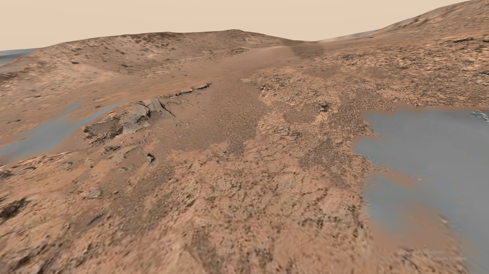
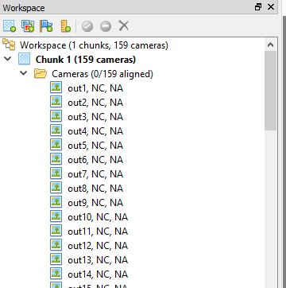
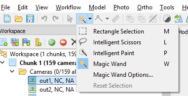
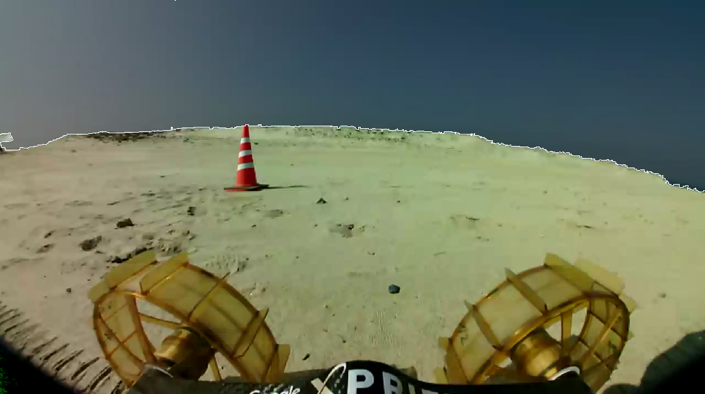
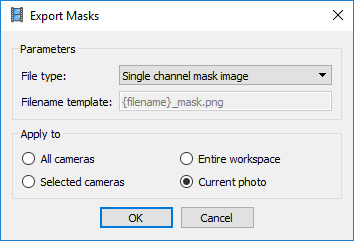
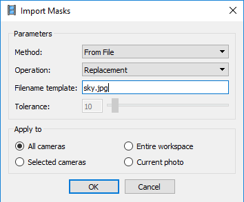
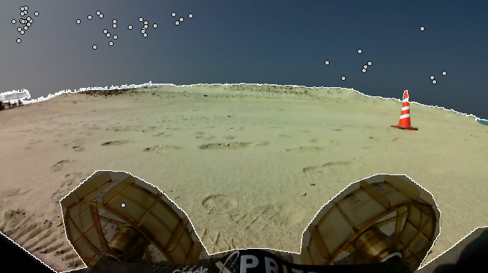
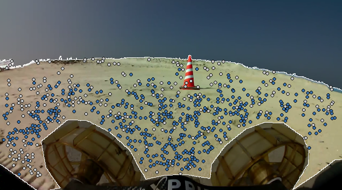

# 3D Reconstruction of Terrain Data via Photogrammetry

Photogrammetry is a technique that allows you to take 2D photos and extract 3D data from them. JPL uses it extensively on our Mars terrain data to build accurate 3D reconstructions. For an example, check out [this website](https://accessmars.withgoogle.com/). The terrain model was generated by our internal photogrammetry pipeline.

Our pipeline uses Curiosity navcam data and uses some other prior data as well, so it's not entirely based on 2D image data, but it's possible to get great results with just 2D data as well.

## Needed Tools

- First, you need photogrammetry software. I use [Agisoft PhotoScan](http://www.agisoft.com/). You can download the Pro version and get a 30-day free trial via a [quick web form](http://www.agisoft.com/downloads/request-trial/). The Standard version should be good enough for most work and is $179 to buy (an [educational license](http://www.agisoft.com/buy/online-store/educational-license/) is even cheaper). For advanced work, some teams write their own custom photogrammetry software (we did it ourselves at JPL), but it's a huge time investment. Photoscan is somewhat scriptable so it's probably enough for your needs.
- PhotoScan uses photos as source data, so if you want to use videos, you'll need to convert them into still images first. I recommend [FFmpeg](https://www.ffmpeg.org/) for this.

## Converting Videos to Images

FFmpeg can easily convert videos to still images. E.g., this line of code will output 2 images for every second of video:

`ffmpeg -i input.mp4 -vf fps=2 out%d.png`

## Key Points and Tie Points

A couple of useful definitions:

- **Key Points** are features; they're pixels of sufficient uniqueness that they can be used as candidates for matching between images.
- **Tie Points** are key points that have been found in multiple images. For example, img0, img2, and img9 may all share a tie point. This means the photogrammetry algorithm has determined that one pixel in each image corresponds to the same feature in the real world. If the algorithm can't find any tie points, 3D reconstruction will fail.

## Loading Images into PhotoScan

Open up PhotoScan. Go to *Workflow -> Add Photos* and add your image set. Expand your Workspace tree and you should see all of the images you loaded, like so:

Each image will be displayed as a separate "camera." PhotoScan doesn't know that they're all taken by the same camera, and will attempt to reverse-engineer the camera calibration parameters.

(Note: you can get better results by setting the camera parameters in *Tools -> Camera Calibration*, but that's outside of the scope of this tutorial. If your image EXIF data contains your camera parameters, this data may fill in automatically.)

Beside each of the images, you'll see NC (Not Calibrated) and NA (Not Aligned). Once you align images, the "NA" should disappear for any images that were used in the alignment.

## Masking Out Unwanted Data

First, we want to mask out anything that isn't terrain, including parts of the rover, the sky, and people walking by. If you don't do this, you'll get artifacts in your reconstructed meshes (we also don't want the sky to be part of the mesh).

Open up the Masking Tools menu like so:

You can use these tools to make a mask on an image. Hold CTRL while using tools add to the already-selected pixels. Hit CTRL-SHIFT-A to add the selected pixels to a mask. Masking out the sky for an image looks like this:

When you go to align photos, there will be two types of masking: "tie point" masking and "key point" masking.

"Key Point" masking means that any key points (i.e., features) found in a given image's masked area will be excluded.

"Tie Points" means that any key points that *match* with points in the masked areas will be excluded. This *theoretically* means that you can mask out objects in a single image and they'll be ignored in every single image, but in practice, this often doesn't work. The best way to generate masks would probably be some Python image processing scripts (e.g., looking for sky-like colors and masking them out). You can then load the masks in bulk via *File -> Import -> Import Masks*.

A manual workaround from a "rover side camera" data set would look like this:

1. First, use the "Intelligent Scissors" tool to mask out the rover body and wheels from a single image. This mask should stay mostly constant between images.
2. Let's save the mask you made. Go to *File -> Export -> Export Masks* and choose to export a mask. Save it as "sky.jpg" or something like that.

You can now import the mask onto all of your images by choosing *File -> Import Masks* and importing "From File."

The rover will now be masked out on every photo.

Now for the crappy part: use the "Magic Wand" tool to mask out the sky in each photo. If you set a good tolerance in the "Magic Wand Options" you may only need to click once for each image (remember that you can use CTRL-SHIFT-A to apply a mask). The Page Down key will go to the next image.

Once you've finished, your masked images should look like this:

You may want to re-export your masks now so you don't accidentally lose them.

## Aligning Photos

Now, let's find an alignment between all of our photos and build a sparse point cloud. Go to *Workflow -> Align Photos* and open up the menu. I recommend using Medium accuracy to start. You should never need Highest accuracy. Make sure to set "Apply masks to" to "Key points," and check "Reset current alignment" if you're redoing this step.

After processing completes, take a look at the photo list in your workspace. Some (hopefully, all) of the photos will now no longer say "NA," meaning that they've been aligned. Double-click a photo to see the key points (grey) and tie points (blue) that were found for it:

If there aren't any tie points for a photo, it wasn't possible to match it to any other photos. If you have photos with lots of tie points that are still remaining in the "NA" state, go back to the Align Photos set, increase the Key Point limit and Tie Point limit, and try again.

Look the Model tab and you'll see a visualization of your sparse point cloud, along with each of the cameras. Visually confirm that it looks accurate (and that each photo camera is positioned where you expect it be) before proceeding.

## Next Steps

At this point, you've done most of the hard work: getting a good sparse point cloud is the most difficult task. Your next steps to building a mesh are:

1. Go to *Workflow -> Build Dense Cloud* to make a more dense point cloud using the rest of the pixel data. At this point, you may want to remove some extraneous points using the point selection tools if they look visibly wrong to you.
2. Go to *Workflow -> Build Mesh* to generate a 3D mesh.
3. Go to *Workflow -> Build Texture* to generate a high-resolution texture for the mesh. (This will make it look much better.)
4. Finally, export the model to a format that you can load in other applications (e.g., Unity, MeshLab, MATLAB, etc.) using *File -> Export Model*.

Here's a sample model that I got using the **HD_movie_500kbps_straight.mp4** video:

<iframe width="640" height="480" src="https://sketchfab.com/models/7be0e5bfb8fd49f9a0e0216538004cba/embed" frameborder="0" allow="autoplay; fullscreen; vr" mozallowfullscreen="true" webkitallowfullscreen="true"></iframe> 
 <a href="https://sketchfab.com/models/7be0e5bfb8fd49f9a0e0216538004cba?utm_medium=embed&utm_source=website&utm_campain=share-popup" target="_blank" style="font-weight: bold; color: #1CAAD9;">ローバーによる地形動画からの測量法実験</a> by <a href="https://sketchfab.com/nattybumppo?utm_medium=embed&utm_source=website&utm_campain=share-popup" target="_blank" style="font-weight: bold; color: #1CAAD9;">nattybumppo</a> on <a href="https://sketchfab.com?utm_medium=embed&utm_source=website&utm_campain=share-popup" target="_blank" style="font-weight: bold; color: #1CAAD9;">Sketchfab</a> 
 

## Tips for Better Photogrammetric Reconstructions

- Use high-resolution data from non-blurry cameras. Exclude any bad or overexposed photos from the data set.
- Overlapping images are key. If images don't share overlapping points, there's no way to align them all together.
- Similar to stereo vision, the depth of objects is obtained from their parallax in images. In other words, what's important is the correspondence of feature points from image to image. This is why it's important to *translate* the camera relative to the scene. If all of the images are taken from a single turn-in-place, the features won't be moving relative to each other, and there won't be any parallax.
- The best results will be obtained from translating the camera orthogonally to the scene. A straight forward drive imaged from the front camera will produce bad results, because you won't see any parallax and photos will be mostly identical.
- In general, the more photos, the better. But aligning a large number of photos will take a long time.
- With PhotoScan, it's a good idea to first try to build a low-quality point cloud and mesh. This lets you see if your results will be at all good--you can then take the time to build a high-quality mesh when you're sure.
- If you have estimates of rover location, you can use this data to inform how the images are aligned. This is very useful; see [this page](http://www.agisoft.com/index.php?id=31) for details.

## Integration with Sensor Data

Fusing the photogrammetric 3D data with ToF camera data would be a terrific way to improve accuracy, but there doesn't seem to be a good way for PhotoScan to support this. (There might be a way I haven't found yet.) You might want to look at other techniques for fusing this data. [Kinect Fusion](https://msdn.microsoft.com/en-us/library/dn188670.aspx) is a good algorithm which can take photo data (for color data), ToF depth data (for a point cloud), and which can then fuse the data together into a coherent mesh.
